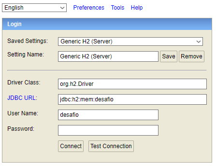

# Controle de manutenção de equipamentos
Trata-se de um sistema para controle de manutenção de equipamentos, cujo objetivo é manter o registro de todas as manutenções realizadas em equipamentos, bem como o registro dos envolvidos em cada manutenção.
Isso é, o registro do **cliente** proprietário do equipamento, o registro do **equipamento**, o registro do **colaborador** que atende o cliente, o registro da **ordem de serviço** para a manutenção e o registro de todos os **acompanhamentos** realizados na ordem de serviço.

## Startup

### Requisitos de instalação

`Gradle 6.7.1+`

`Java 11.0.9+`

### Download do projeto

Obs: As instruções de instalação apresentadas neste documento são compatíveis com sistema operacional Windows.

Faça o clone do projeto através do link:

`https://github.com/viniciusbsi/controle-manutencao-equipamentos.git`

Para executar o projeto, vá ao diretório `\controle-manutencao-equipamentos` e instale as dependências conforme descrito a seguir:

### Download das dependências

#### JDK 11: [Download](https://www.oracle.com/java/technologies/javase-jdk11-downloads.html) | [Instalação](https://docs.oracle.com/en/java/javase/11/install/installation-jdk-microsoft-windows-platforms.html#GUID-96EB3876-8C7A-4A25-9F3A-A2983FEC016A) 
#### Gradle 6: [Download](https://gradle.org/releases/) | [Instalação](https://gradle.org/install/)

### Instalação do projeto

Para a instalação e inicialização do projeto, execute os comandos na seguinte ordem:

`gradle build` - Executa o build do projeto

`gradle run` - Inicializa o projeto

Após a inicialização, a utilização do projeto estará disponível por meio da URL [http://localhost:8080/swagger-ui.html](http://localhost:8080/swagger-ui.html).

Obs: Caso o serviço não esteja disponível, verifique a porta utilizada pelo servidor web. O número da porta pode ser consultada no terminal, o resultado apresentado deve ser semelhante a: `Tomcat started on port(s): [NÚMERO DA PORTA] (http)`

## Documentação do projeto

### Descrição do cenário

Uma empresa de manutenção de equipamentos, precisa controlar todos os estágios da execução de um serviço. 

Um cliente se dirige a um recepcionista que registra uma ordem de serviço, com os dados do equipamento danificado. O recepcionista coleta algumas informações sobre o cliente, tais como nome, endereço, telefone e email e também do equipamento, como um descritivo do equipamento (tipo, marca) e também sobre o problema. 

Após o registro da ordem de serviço, os responsáveis pela execução devem registrar o início do atendimento e posteriormente a finalização do serviço com os devidos detalhes do que foi executado.

### Requisitos funcionais:

O sistema deve manter os registros de equipamentos;

O sistema deve manter os registros de colaboradores;

O sistema deve manter os registros de clientes;

O sistema deve manter os registros de ordens de serviços;

O sistema deve manter os registros de acompanhamentos;

O sistema deve permitir a inclusão de colaboradores do setor de manutenção e atendimento;

O sistema deve permitir a inclusão de acompanhamentos associados aos seguintes status: pendente; em andamento; interrompido; finalizado.

O sistema deve definir automaticamente a data de início da ordem de serviço quando for incluído um acompanhamento com status diferente de pendente e finalizado associado à ordem de serviço;

O sistema deve definir automaticamente a data de término  da ordem de serviço quando for incluído um acompanhamento com status igual a finalizado associado à ordem de serviço;

O sistema não deve permitir que seja incluído um acompanhamento com status finalizado associado a uma ordem de serviço que não tenha um acompanhamento com status interrompido ou em andamento previamente incluído.

### Requisitos não funcionais:

Desenvolvimento de uma aplicação utilizando a linguagem Java;

Desenvolvimento de uma aplicação utilizando o framework Spring Boot;

Desenvolvimento de uma aplicação REST;

Documentação da API utilizando Swagger;

### Modelo entidade relacionamento

### Acesso ao banco de dados

Para a visualização da estrutura e consultas no banco de dados, acesse `http://localhost:8080/h2` e insira os parâmetros conforme figura abaixo.

Obs: Caso o serviço não esteja disponível, verifique a porta utilizada pelo web service.

